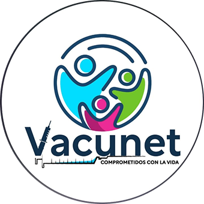

# Vacunet - Sistema de Gestión para Centros de Vacunación



Vacunet es una aplicación web full-stack diseñada para la gestión integral de un centro de vacunación. El sistema permite a los administradores manejar pacientes, citas, inventario y certificados de manera eficiente, a la vez que ofrece un portal público para que los usuarios validen sus certificados.

Este proyecto fue desarrollado como un sistema completo que abarca desde el diseño de la base de datos y la API RESTful hasta una interfaz de usuario interactiva y segura.

---
## 🚀 Funcionalidades Principales

La aplicación cuenta con una robusta serie de módulos para una gestión completa:

* **🛡️ Autenticación y Seguridad:**
    * Inicio de sesión seguro para administradores con credenciales validadas.
    * Gestión de sesiones mediante **JSON Web Tokens (JWT)** almacenados en cookies `httpOnly`.
    * **Middleware de protección** para asegurar que solo los administradores autenticados puedan acceder a las rutas protegidas de la API.

* **👥 Gestión de Pacientes (CRUD):**
    * **Crear, Leer, Actualizar y Eliminar** registros de pacientes.
    * Búsqueda de pacientes por número de cédula.
    * Validación de integridad que previene la eliminación de pacientes con citas activas.

* **📅 Gestión de Citas:**
    * **Agendamiento dinámico** de citas con selección de una o múltiples vacunas.
    * Visualización de citas programadas y gestión de su estado (**Completada, Cancelada**).
    * **Archivado automático** de citas pasadas (perdidas) y canceladas en tablas históricas.

* **📦 Gestión de Inventario:**
    * Visualización de lotes de vacunas con cantidad y fecha de caducidad.
    * **Paginación** en el backend para manejar grandes volúmenes de datos.
    * **Alertas visuales** para lotes con bajo stock o próximos a vencer.
    * Formularios para ingresar y editar lotes.

* **📄 Certificados e Informes:**
    * **Generación automática** de certificados al completar una cita.
    * **Portal de consulta pública** para que cualquier usuario valide su certificado por cédula.
    * Visualización de certificados con un diseño profesional, listos para **imprimir o descargar como imagen**.
    * Generación de **informes** de vacunas aplicadas por mes, semestre o año.

---
## 🛠️ Tecnologías Utilizadas

* **Backend:**
    * **Node.js** con **Express.js** para la creación de la API RESTful.
    * **MySQL** como base de datos relacional, gestionada con la librería `mysql2/promise`.
    * **JSON Web Token (jsonwebtoken)** para la autenticación.
    * **bcrypt** para la encriptación segura de contraseñas.
    * **CORS** y **cookie-parser** para la gestión de peticiones y cookies.

* **Frontend:**
    * **HTML5** y **CSS3** para la estructura y el diseño.
    * **JavaScript (ES6+)** nativo para toda la lógica del cliente, incluyendo:
        * Manipulación dinámica del DOM.
        * Peticiones a la API con `fetch`.
        * Gestión de estado de sesión con `sessionStorage`.
    * **html2canvas** para la funcionalidad de descarga de certificados.

---
## ⚙️ Instalación y Puesta en Marcha

Sigue estos pasos para ejecutar el proyecto en un entorno local.

### Prerrequisitos
* Tener instalado [Node.js](https://nodejs.org/).
* Tener un servidor de base de datos MySQL (se recomienda [XAMPP](https://www.apachefriends.org/es/index.html)).

### Pasos
1.  **Clonar el repositorio:**
    ```bash
    git clone [https://github.com/crisdavid010/vacunetapp.git](https://github.com/crisdavid010/vacunetapp.git)
    cd vacunetapp
    ```
2.  **Instalar dependencias del backend:**
    ```bash
    npm install
    ```
3.  **Configurar la Base de Datos:**
    * Asegúrate de que tu servidor MySQL esté corriendo (desde XAMPP).
    * Importa el archivo `.sql` de la base de datos para crear la estructura de tablas y los datos iniciales.
    * Verifica que los datos de conexión en `server.js` (`host`, `user`, `password`, `database`) coincidan con tu configuración local.

4.  **Iniciar el Servidor de la API:**
    ```bash
    node server.js
    ```
    La terminal debería mostrar el mensaje "Servidor API corriendo en http://localhost:3000".

5.  **Abrir el Frontend:**
    * Usando XAMPP, coloca el proyecto en la carpeta `htdocs` y accede desde tu navegador a `http://localhost/vacunetapp/public/`.
    * O usando la extensión **Live Server** en Visual Studio Code, haz clic derecho sobre un archivo `.html` en la carpeta `public` y selecciona "Open with Live Server".
